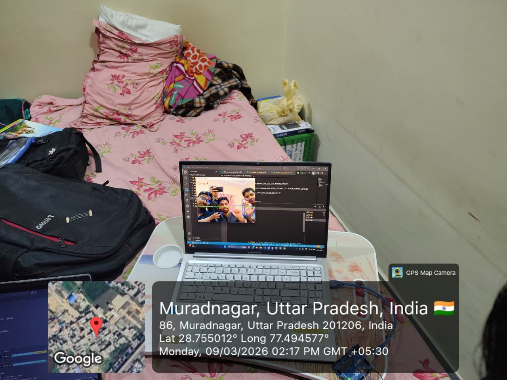

# 🚦 Next-Gen Traffic Management

An AI-powered traffic signal control system that uses computer vision to dynamically manage traffic flow in real time — replacing fixed-timer signals with intelligent, adaptive control.

---

## 📌 Overview

Next-Gen Traffic Management leverages Python and OpenCV to detect and analyze live traffic density at intersections. Instead of relying on pre-set signal timers, the system dynamically adjusts green/red light durations based on actual vehicle presence — reducing congestion and improving throughput.

---

## ✨ Features

- 🎥 **Real-time video feed processing** using OpenCV
- 🚗 **Vehicle detection** via frame differencing / contour analysis
- 🧠 **Adaptive signal timing** based on detected traffic density
- 🔄 **Multi-lane support** for intersection management
- 📊 **Live visual feedback** with annotated video output

---

## 🛠️ Tech Stack

| Component        | Technology        |
|------------------|-------------------|
| Language         | Python 3.x        |
| Computer Vision  | OpenCV            |
| Image Processing | NumPy             |
| Visualization    | OpenCV GUI  |

---

## 📁 Project Structure

```
Next-Gen-Traffic-Management/
│
├── main.py                  # Entry point — runs the traffic control loop
├── detector.py              # Vehicle detection logic
├── signal_controller.py     # Adaptive signal timing engine
├── utils.py                 # Helper functions
│
├── output/                  # Processed output frames/videos
│
├── requirements.txt
└── README.md
```

> **Note:** Folder structure may vary. Update this section to match your actual repository layout.

---

## ⚙️ Installation

### Prerequisites

- Python 3.8+
- pip

### Steps

```bash
# 1. Clone the repository
git clone https://github.com/DeepTensor-3070/Next-Gen-Traffic-Management.git
cd Next-Gen-Traffic-Management

# 2. Install dependencies
pip install -r requirements.txt

# 3. Run the application
python main.py
```

---

## 🚀 Usage

1. Place your traffic video file (or configure a webcam feed) in the `assets/` folder.
2. Update the video source path in `main.py` if needed.
3. Run `python main.py` — the system will begin detecting vehicles and controlling signals adaptively.
4. Press `q` to quit the live window.

---

## 🧠 How It Works

```
Video Feed → Frame Preprocessing → Vehicle Detection → Density Estimation
                                                              ↓
                                              Signal Timer Adjusted Dynamically
                                                              ↓
                                              Annotated Output Displayed / Saved
```

1. **Frame Capture** — Reads frames from a video file or live camera.
2. **Background Subtraction / Contour Detection** — Identifies moving vehicles using OpenCV.
3. **Density Calculation** — Counts vehicles per lane/zone.
4. **Signal Control Logic** — Allocates green time proportionally to traffic load.
5. **Output** — Displays annotated frames with signal state and vehicle count overlays.

---

## 📷 Demo

> 

---

## 🔮 Future Improvements

- [ ] Integrate YOLOv8 for more accurate vehicle detection
- [ ] Add emergency vehicle priority detection
- [ ] Web dashboard for real-time monitoring
- [ ] Multi-intersection coordination
- [ ] Night-mode / low-light performance improvements

---

## 🤝 Contributing

Contributions are welcome! Feel free to open issues or submit pull requests.

```bash
# Fork → Create your branch → Commit → Push → Open PR
git checkout -b feature/your-feature-name
```

---

## 📄 License

This project is licensed under the [MIT License](LICENSE).

---

## 👤 Author

**DeepTensor**
- GitHub: [@DeepTensor-3070](https://github.com/DeepTensor-3070)
